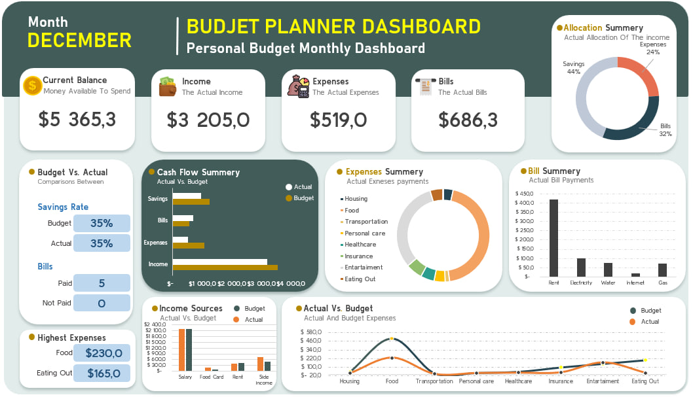
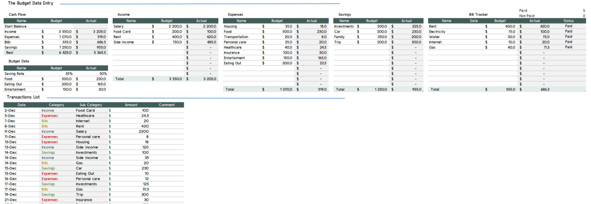

# 🧾 Personal Budget Dashboard (Excel)

An interactive personal finance dashboard built in **Microsoft Excel** to analyze monthly income, expenses, bills, savings, and overall cash flow.  
This project helped me strengthen my skills in **data cleaning, KPI modeling, financial analytics, and dashboard design**.

## 🎯 Project Objective

The goal of this project is to create a clear and practical **monthly budget dashboard** that improves financial visibility and supports better decision-making.

Key objectives:

- Track income, expenses, bills, and savings in a single structured workflow  
- Compare **budget vs. actual** financial performance  
- Highlight overspending and key cost drivers  
- Visualize cash flow with intuitive charts  
- Practice Excel analytics and visualization techniques  

## 📂 Dataset Used

The dataset contains manually prepared monthly financial information:

- Income sources  
- Expense categories  
- Savings allocations  
- Bill payments  
- Transaction list (date, category, subcategory, amount)

All data was cleaned, organized, and analyzed in Excel.

## 📊 Key Questions (KPIs)

The dashboard helps answer:

- What is the **current monthly balance**?  
- How much was earned vs. spent?  
- What are the total **expenses, bills, and savings**?  
- Which categories exceeded the planned budget?  
- What is the **savings rate**?  
- Which expenses were the highest?  
- How many bills were **paid vs. pending**?  
- How does actual performance compare to the budget?

## ⚙️ Process

1. Prepared and cleaned the transaction dataset  
2. Built structured Budget and Actual tables  
3. Calculated KPIs using:
   - `SUMIF`  
   - `XLOOKUP`  
   - `SUBTOTAL`  
   - `LARGE`  
4. Designed dashboard components:
   - KPI cards (Balance, Income, Expenses, Bills, Savings)  
   - Cash flow summary (Budget vs Actual)  
   - Expense breakdown chart  
   - Bill tracker table  
   - Income source comparison  
   - Actual vs. Budget chart  
5. Applied consistent formatting and layout for readability  

## 📈 Dashboard Overview

The final Excel dashboard includes:

- Current Balance  
- Income, Expenses, Bills, Savings KPIs  
- Cash Flow Summary (Budget vs Actual)  
- Expense Breakdown (donut chart)  
- Bill Payment Tracker  
- Income Source Breakdown  
- Highest Expenses highlight  
- Savings Distribution  
- Actual vs Budget performance chart  

## 🎥 Dashboard Demo (MP4)

You can watch a short demo of how the dashboard works and how the charts update when the data changes:

👉 **[Click here to watch the video](Media/personal_budget_dashboard_demo.mp4)**

*Video demo of the interactive Excel dashboard. The video has no sound.*

## 📸 Screenshots

### Main Dashboard  

### Budget Data Entry  

## 💡 Key Insights

- Food and entertainment were the highest spending categories  
- Bills exceeded the planned budget  
- Savings performance was stronger than expected  
- Most bills were paid on time (only one pending)  
- Income remained consistent with the forecast  

## 🧠 Final Conclusion

This project improved my understanding of:

- Personal finance analytics  
- KPI modeling and variance analysis  
- Excel dashboard design  
- Transforming raw data into actionable insights  
- Using Excel functions for financial reporting  

It also sets a foundation for creating more advanced dashboards in **Power BI**.

## 🛠 Tools & Skills

**Tools:**  
- Microsoft Excel  

**Skills:**  
- Data Cleaning  
- KPI Analysis  
- Financial Modeling  
- Dashboard Design  
- Pivot Tables  
- Data Visualization  

⭐ *Created as part of my data analytics learning journey to improve finance-focused analysis and Excel dashboard skills.*

